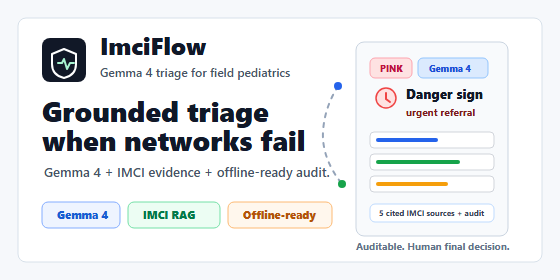
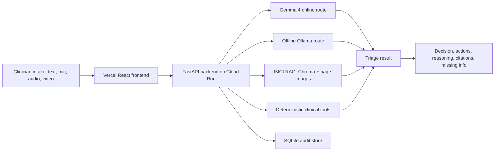

<p align="center">
  
</p>

<h1 align="center">ImciFlow</h1>

<p align="center">
  Gemma 4-first clinical decision support for pediatric triage in low-resource and crisis settings.
</p>

<p align="center">
  <a href="https://gemma-4-hackathon.vercel.app">Live demo</a>
  |
  <a href="https://imciflow-backend-3yhstsh2za-uc.a.run.app/health">Backend health</a>
  |
  <a href="docs/kaggle_writeup_final.md">Kaggle writeup</a>
  |
  <a href="docs/demo_script.md">Demo script</a>
</p>

<p align="center">
  
  
  
  
  
</p>

## Overview

ImciFlow is a multilingual pediatric triage assistant designed for clinics where staffing,
connectivity, language access, and protocol lookup time are all constrained. The system uses
Gemma 4 as the clinical synthesis layer, grounds recommendations in IMCI reference material,
and keeps safety-critical logic in deterministic Python tools.

The product is not an autonomous diagnosis system. It is a clinical decision-support workflow
for qualified health workers. Final decisions remain with medical staff.

## Why It Matters

In crisis clinics and low-connectivity settings, clinicians often need to move fast while still
following structured protocols. ImciFlow demonstrates a practical pattern for field AI:

- collect multilingual symptoms through text, microphone dictation, audio upload, or respiratory video;
- retrieve relevant IMCI evidence, including rendered chart pages;
- run deterministic checks for danger signs, pneumonia thresholds, dehydration, fever, and missing data;
- use Gemma 4 to synthesize a concise, auditable triage recommendation;
- preserve an offline-ready architecture for deployments where internet access fails.

## Live Submission Assets

| Asset | Link |
| --- | --- |
| Live frontend | https://gemma-4-hackathon.vercel.app |
| Public backend health | https://imciflow-backend-3yhstsh2za-uc.a.run.app/health |
| Kaggle writeup draft | [docs/kaggle_writeup_final.md](docs/kaggle_writeup_final.md) |
| Video script and recording guide | [docs/demo_script.md](docs/demo_script.md) |
| Kaggle card thumbnail | [docs/media/kaggle-card-thumbnail.png](docs/media/kaggle-card-thumbnail.png) |

## Core Capabilities

- **Gemma 4-first reasoning**: online Gemma 4 is the primary demo path for clinical synthesis.
- **Online/offline routing**: the same API supports `auto`, `online`, and `offline` model modes.
- **IMCI-grounded retrieval**: local Chroma retrieval over IMCI PDFs, page text, captions, and rendered page images.
- **Deterministic safety layer**: Python tools detect danger signs, respiratory thresholds, dehydration, fever, and referral needs.
- **Multilingual workflow**: English, French, and Sudanese Arabic intake/output paths.
- **Live progress stream**: the frontend consumes `/triage/run/stream` for real backend pipeline events.
- **Audio and video support**: local Whisper transcription and supportive respiratory-rate analysis.
- **Auditability**: sessions are persisted with inputs, outputs, model route, timing, evidence, and safety flags.

## Gemma 4 Usage

| Role | Implementation |
| --- | --- |
| Clinical extraction | Converts messy multilingual intake into structured clinical signals. |
| Grounded synthesis | Combines extracted symptoms, deterministic tool outputs, and IMCI context. |
| Caregiver communication | Produces concise explanations in the selected output language. |
| Model routing | Online Gemma 4 is used for the hosted demo; offline mode routes to local Ollama when available. |

The safety-critical classifications are not left to the model alone. Gemma 4 is paired with
retrieval, deterministic rules, evidence citations, and human-review guardrails.

## Architecture



## API Surface

| Endpoint | Purpose |
| --- | --- |
| `GET /health` | Runtime status, model route availability, RAG/database availability. |
| `POST /triage/run` | Standard triage execution. |
| `POST /triage/run/stream` | Streaming triage execution with backend node events. |
| `POST /audio/transcribe` | Upload audio and receive local Whisper transcript. |
| `POST /video/analyze` | Upload respiratory video and receive supportive breathing-rate evidence. |
| `GET /sessions/{session_id}` | Retrieve the audit record for a triage session. |

## Repository Map

```txt
ai/
  agent/             Gemma 4 orchestration, routing, reasoning nodes
  rag/               IMCI ingestion, embeddings, vector retrieval
  tools/             Deterministic clinical tools
apps/
  backend/           FastAPI service, Docker image, API tests
  frontend/          React, Vite, TypeScript, streaming UI
data/
  chroma/            Packaged demo RAG index
  page_images/       Rendered IMCI page evidence
docs/
  *.md               Architecture, deployment, demo, submission documentation
scripts/
  evaluate_clinical_cases.py
tests/
  Backend, agent, RAG, and clinical safety tests
```

## Local Development

### Backend

```powershell
cd GEMMA-4-HACKATHON
python -m venv .venv
.\.venv\Scripts\Activate.ps1
pip install -r apps\backend\requirements.txt
Copy-Item .env.example .env
$env:PYTHONPATH = (Get-Location).Path
uvicorn apps.backend.main:app --reload --host 0.0.0.0 --port 8000
```

### Frontend

```powershell
cd GEMMA-4-HACKATHON\apps\frontend
Copy-Item .env.example .env.local
npm install
npm run dev
```

Expected local URLs:

- Frontend: `http://localhost:5173`
- Backend: `http://localhost:8000`

## Environment Variables

Key backend variables:

```txt
GOOGLE_AI_API_KEY=...
GEMMA_ONLINE_MODEL=models/gemma-4-26b-a4b-it
OLLAMA_BASE_URL=http://localhost:11434
GEMMA_OFFLINE_MODEL=gemma4:e4b-it
CHROMA_PATH=./data/chroma
RAG_VISUAL_ASSETS_PATH=./data/page_images
DB_PATH=./data/imciflow.db
FRONTEND_ORIGIN=http://localhost:5173,https://gemma-4-hackathon.vercel.app
```

Frontend:

```txt
VITE_API_BASE_URL=http://localhost:8000
```

For production, Vercel must point `VITE_API_BASE_URL` to the Cloud Run backend URL.

## Verification

Backend and clinical evaluation:

```powershell
.\.venv\Scripts\python.exe -m pytest
.\.venv\Scripts\python.exe scripts\evaluate_clinical_cases.py
```

Expected clinical evaluation result:

```txt
Clinical eval: 15/15 passed (100%)
```

Frontend:

```powershell
cd apps\frontend
npm run test
npm run build
npm run test:e2e
```

Recent submission hardening verified:

- backend and agent tests passed;
- frontend unit tests and production build passed;
- Playwright E2E passed;
- Docker backend image build passed;
- Cloud Run deployment healthy;
- 15-case deterministic IMCI evaluation passed.

## Deployment

### Frontend: Vercel

- Framework preset: `Vite`
- Root directory: `apps/frontend`
- Build command: `npm run build`
- Output directory: `dist`
- Required variable: `VITE_API_BASE_URL=https://YOUR_CLOUD_RUN_URL`

### Backend: Google Cloud Run

The backend is built and deployed from `cloudbuild.yaml`:

```powershell
gcloud builds submit --config cloudbuild.yaml
```

The Cloud Run demo packages the local Chroma IMCI index and rendered IMCI page images. Offline
mode is shown as a local field-deployment architecture through Ollama, not as the public Cloud Run
runtime.

## Safety Scope

ImciFlow is designed for demonstration and research validation. It must not be used as a
standalone medical device. The system always presents itself as clinical decision support, keeps
human review in the loop, exposes missing information, and surfaces safety flags instead of hiding
uncertainty.

## License

MIT. See [LICENSE](LICENSE).
